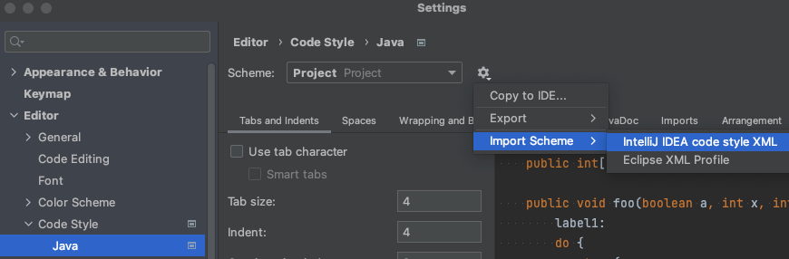

# Digma Code styling

## How to import the styling into IntelliJ

Go to menu "Settings/Preferences" > "Editor" > "Code Style"

* Click on the gear icon next to the "Scheme" dropdown
* From there, select "Import Scheme"
* In the "Import Scheme" dialog, select "IntelliJ IDEA code style XML"
* Now choose the file digma_java_styling_idea.xml which resides in this guide folder

Here's a print screen of it:

After importing you should see the following:

